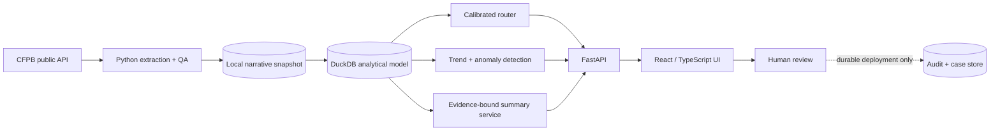

# CFPB Complaint Operations & AI Triage

A full-stack, human-in-the-loop operations application built from the public
[CFPB Consumer Complaint Database](https://www.consumerfinance.gov/data-research/consumer-complaints/).
It helps a complaints-operations manager triage a queue, inspect emerging
themes, and monitor routing quality without allowing a model to make the final
decision.

The application follows this path:

```text
CFPB API -> validated snapshot -> DuckDB/SQL model -> routing + anomaly models
         -> FastAPI -> React/TypeScript operations interface
```

Evaluation claims are tied to the frozen, hashed snapshot and release artifacts
described below. The public deployment is verified at the bounded live-read
endpoints listed in the deployment runbook; it is not a production case system.

## What the application supports

- A reproducible request for up to 100,000 recent public complaints, with a
  request record, SHA-256 hashes, schema checks and an immutable manifest.
- A DuckDB analytical layer with documented metrics and source-to-serving
  lineage.
- Chronologically evaluated product routing with macro-F1, calibration,
  an explicit abstention threshold and a manual-review queue. Product and issue labels are also monitored as separate trend/anomaly dimensions; issue routing is not claimed.
- Product/issue trend monitoring and anomaly flags that provide evidence for
  investigation rather than causal claims.
- Evidence-grounded narrative summaries that validate against a Pydantic
  schema, preserve verbatim supporting excerpts, expose refusals/failures and
  require a named human approval action.
- A case queue, operations dashboard and model-monitoring interface.
- Containerised local execution, automated tests and GitHub Actions.

### Manual human review evidence

The frozen 50-case summary sample was manually reviewed with AI assistance under
private local controls. The public aggregate record reports a mean factuality
score of **4.86/5**, an all-claims-supported rate of **0.90**, and an exact-quote
rate of **1.0**. The [aggregate artifact](artifacts/public/summary_factuality_review_metrics.json),
[release provenance](artifacts/public/release_provenance.json), [snapshot
manifest](data/manifests/snapshot_manifest.json), [QA summary](artifacts/public/cfpb_quality_summary.json),
[router metrics](artifacts/public/product_router_metrics.json) and [evaluation
notes](docs/metrics-and-evaluation.md) are public; narratives,
generated drafts and the row-level worksheet remain private. These results are
for the documented frozen selection frame, not a representative population or a
comparative company-performance claim.

## Decision boundary

The model proposes a route and can abstain. A person confirms or overrides the
route. An LLM draft is never a final case disposition, company response or
regulatory determination. In public-demo mode all review actions are explicitly
ephemeral; a production workflow requires authentication, authorisation, an
append-only audit log and a durable transactional store.

## Data and interpretation boundary

The CFPB states that complaint data are not a statistically representative
sample of consumers' experiences. Submission channels, consumer awareness,
population, product usage and company size all affect counts. This project
therefore does **not** rank companies from raw complaint totals or interpret
those totals as comparative performance without defensible exposure or
market-share denominators.

The database generally updates daily, but an eligible complaint is published
after the company responds confirming a commercial relationship or after 15
days, whichever comes first. Recent periods can therefore be incomplete, and
narrative processing can add further lag. Trend views disclose the snapshot
timestamp and publication-lag boundary.

Published narratives appear only when consumers consent and after the CFPB
takes steps to remove personal information. Consent can later be withdrawn.
Raw narratives and narrative-bearing DuckDB files are therefore local-only and
excluded from Git. The repository may contain only the request specification,
manifest and hashes, privacy-reviewed aggregates, frozen evaluation outputs and
reviewed model artifacts. See [the data card](docs/lineage-data-card.md).

## Architecture



The detailed trust boundaries and runtime paths are in
[architecture.md](docs/architecture.md).

## Repository layout

```text
backend/                 Python package, FastAPI, data/ML pipeline and tests
frontend/                React/TypeScript interface and tests
data/                    Safe request/manifest metadata; local data are ignored
artifacts/public/        Privacy-reviewed metrics and model artifacts, when built
docker/                  Reproducible service images and reverse-proxy config
docs/                    Requirements, metrics, lineage and runbook
.github/workflows/       CI checks
app.py                   Deployment-compatible ASGI entry point
docker-compose.yml       Local full-stack runtime
```

The public demonstration is deployed as two Vercel projects from the verified
application release SHA (`7d7c26d`):

- API: <https://cfpb-complaint-ops-api.vercel.app>
- Interface: <https://cfpb-complaint-ops-web.vercel.app>

The API performs a bounded live CFPB read of at most 25 current records per
request and returns `data_mode=bounded_live_cfpb_read`. Live cases have no
trained router, remain abstained and require human review. Public route writes
are disabled (`persistence_mode=disabled_public_writes`) rather than stored in
shared process memory; a durable workflow requires authentication and a
transactional store.
Public LLM generation is disabled, and no OpenAI key is shipped to the browser.
See the [deployment runbook](docs/deployment-runbook.md) for release gates and
cross-origin verification.

## Quick start

### Docker Compose

Requirements: Docker with Compose v2 and enough local storage for the chosen
snapshot size.

```bash
cp .env.example .env.local
docker compose build
docker compose run --rm backend cfpb-triage bootstrap-demo
docker compose up
```

Open `http://localhost:8080`. The API health probe is available at
`http://localhost:8080/api/health`.

The default environment keeps LLM calls disabled and public-demo semantics on.
To exercise live summary generation, store an API key only in `.env.local`,
enable `LLM_SUMMARY_ENABLED`, and retain mandatory human approval.

### Native development

```bash
python -m venv .venv
# Windows PowerShell: .venv\Scripts\Activate.ps1
# macOS/Linux: source .venv/bin/activate
python -m pip install --upgrade pip
python -m pip install -e "./backend[dev]"
uvicorn app:app --reload --port 8000
```

In another terminal:

```bash
cd frontend
corepack enable
pnpm install --frozen-lockfile
pnpm run dev
```

Use `cfpb-triage --help` for the installed command contract. A bounded
real-data run starts with `cfpb-triage snapshot --as-of YYYY-MM-DD
--max-records N`, followed by `cfpb-triage qa PATH --as-of YYYY-MM-DD`.
`build-all` runs the gated pipeline; `train`, `anomalies`, and
`freeze-summary-eval` produce the model, trend, and manual-review artifacts.
Run these commands against local storage only.

## Verification

```bash
python -m pytest backend/tests
python -m ruff check backend
python -m ruff format --check backend
cd frontend
pnpm install --frozen-lockfile
pnpm run lint
pnpm test
pnpm run build
```

CI also scans tracked paths to prevent raw narrative snapshots, DuckDB files or
populated environment files from being published.

## Documentation

- [Architecture and trust boundaries](docs/architecture.md)
- [User stories and acceptance criteria](docs/requirements.md)
- [Metric and evaluation definitions](docs/metrics-and-evaluation.md)
- [Lineage and data card](docs/lineage-data-card.md)
- [Deployment runbook](docs/deployment-runbook.md)

## Sources

- [CFPB Consumer Complaint Database](https://www.consumerfinance.gov/data-research/consumer-complaints/)
- [CFPB complaint database field reference](https://cfpb.github.io/api/ccdb/fields.html)
- [CFPB complaint database API documentation](https://cfpb.github.io/api/ccdb/)

## Licence

Application code and documentation are released under the [MIT License](LICENSE).
CFPB source data remain subject to the source site's terms and publication
controls; the dataset is not bundled with this repository.
