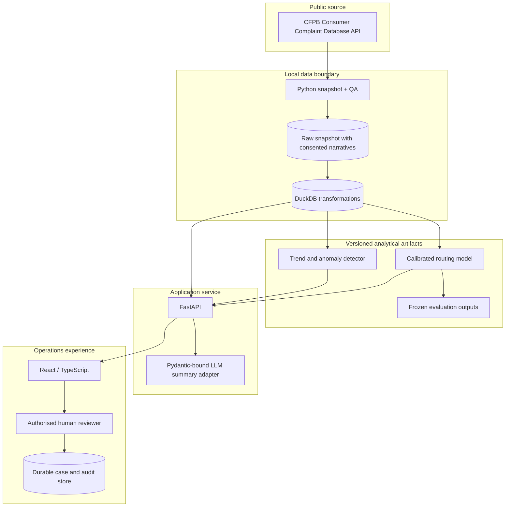

# Architecture and trust boundaries

## Purpose

The system supports a complaints-operations manager who needs to route incoming
work, find cases requiring manual attention, detect emerging themes and monitor
operations and model behaviour. It is a decision-support system. It does not
send company responses, close complaints or make regulatory determinations.

## System context

The repository keeps source code, request metadata, hashes and privacy-reviewed
artifacts. It does not keep the `Raw` or narrative-bearing `Duck` stores.

## Components

### 1. Snapshot and QA

The extraction command accepts an explicit UTC `as_of` date and a maximum
record count no greater than 100,000. It records the canonical request, source
URL, extraction timestamps, ordering, pagination, selected fields, response
metadata and software revision. The raw payload and canonical row export are
hashed before transformation.

QA is a gate, not a dashboard decoration. At minimum it verifies:

- the count is positive and does not exceed the requested maximum;
- complaint IDs are present and unique after deterministic de-duplication;
- required product, issue, submission-date, response and timeliness fields are
  present, with missingness reported rather than silently imputed;
- dates parse and fall on or before the declared snapshot boundary;
- categorical values and booleans are normalised without erasing the raw value;
- narrative availability is measured, because consented narratives are a
  non-random subset;
- the raw and canonical hashes match the manifest; and
- a failed check prevents model or serving artifacts from being promoted.

The live CFPB source can change retrospectively, including when narrative
consent is withdrawn. The manifest proves what was processed; it does not imply
that a future API call can reconstruct identical bytes.

### 2. DuckDB analytical model

SQL transformations preserve the original complaint ID and build explicit
dimensions for submission date, product, issue, response, timeliness and
narrative availability. Transformation outputs carry the snapshot ID and SQL
or code revision. Views used by the UI expose only the fields needed for the
decision and safe aggregates where possible.

DuckDB is appropriate for a reproducible local analytical demonstration. A
single local file is not a multi-user case-management database. Production
approval events require a transactional store with identity, concurrency
control, backups and an append-only audit history.

### 3. Routing model

The routing model predicts an existing product or issue label from fields that
would be available at routing time. Training and evaluation are chronological:
training precedes validation, which precedes the frozen test period. The
validation period alone selects calibration and the abstention threshold. The
test period is opened once for the final reported evaluation.

The API returns the proposed label, calibrated confidence, model version and an
abstention/manual-review state. It never writes the proposal as a final route.
Human confirmation and override are separate events.

### 4. Trend and anomaly detection

Counts are aggregated by date, product and issue. A current interval is
compared only with prior observations; the detector must not leak the current
or future period into its baseline. Each flag returns observed volume,
baseline, deviation, window, minimum-support rule and snapshot timestamp.
Flags invite investigation and are not evidence of causation or company
performance.

Recent periods are publication-lag sensitive. The UI labels them as incomplete
or excludes a configured right-censoring interval from anomaly evaluation.

### 5. Evidence-grounded summary

The summary adapter receives a supplied, consented narrative and stable case
metadata. Its response must validate against a Pydantic schema that includes:

- a concise draft summary;
- one or more verbatim evidence excerpts copied from the supplied narrative;
- the proposed themes or attention flags;
- limitations or missing evidence;
- model/version and token/latency/cost metadata; and
- `approval_status` initially set to `pending_human_review`.

Server-side validation verifies that every quoted excerpt exists verbatim in
the supplied narrative. Schema failure, missing evidence, policy refusal,
timeout or provider failure becomes an explicit refusal/failure state. No
fallback text is mislabelled as an LLM result. The raw prompt and output are not
logged by default because they can contain narrative text.

### 6. FastAPI

FastAPI is the single application contract for the interface. `GET /health`
provides a dependency-light liveness response. Read endpoints expose queue,
dashboard, anomaly and monitoring views; summary generation and human-review
actions are bounded commands. Request IDs, artifact versions and structured
error codes support observability without logging narrative bodies.

### 7. React/TypeScript interface

The interface has three operational views:

- **Case queue:** filters, attention reasons, proposed route, confidence,
  abstention, evidence and an explicit human approve/override control.
- **Operations dashboard:** volumes, timely-response rate, product/issue trends,
  anomaly evidence and snapshot/publication-lag labels.
- **Model monitoring:** frozen metrics, coverage/abstention, calibration, false
  routes, drift, summary review results, latency, cost and failures/refusals.

The CFPB representativeness limitation remains visible on analytical views. Raw
company counts are not turned into performance league tables.

## Deployment topologies

### Local/full-stack demonstration

Docker Compose runs the FastAPI service, static React image and Nginx gateway.
Local volumes hold the DuckDB file and artifacts. This topology demonstrates
the complete application path but remains a single-user/local-data design.

### Public Vercel demonstration

The public demonstration uses two Vercel projects built from the same pushed
Git commit:

- the repository-root project serves FastAPI in `PUBLIC_DEMO_MODE=true`; and
- the `frontend/` project builds the static Vite interface and points
  `VITE_API_BASE_URL` at the backend project's HTTPS origin.

The serverless backend uses synthetic, non-narrative demo records and no local
CFPB snapshot or narrative-bearing DuckDB. Review endpoints demonstrate the
contract, but memory and ephemeral filesystem state can reset between requests,
instances or deployments. The interface therefore labels review interactions
session-only; there is no implication that an approval is durably recorded. No
OpenAI key is shipped to the browser, and public LLM calls remain disabled.

### Durable operational deployment

A real multi-user deployment adds authenticated identity, role-based access,
a durable case/audit database, encrypted object storage with withdrawal and
retention procedures, managed secrets, network controls, backups and incident
response. That topology is outside the claim made by the public portfolio demo.

## Security and privacy controls

- Secrets are server-side only and populated through an encrypted environment
  store; `.env.local` is ignored.
- Raw snapshots, narrative-bearing exports and DuckDB files are local-only.
- CI blocks common row-level data and environment-file paths from Git.
- Logs use request IDs and categorical failure codes, not narratives.
- Summary quotes are bounded and shown only for the active human review.
- Container services run with minimal privileges where supported.
- Human decisions are distinct from model proposals in the API and data model.

## Failure behaviour

The queue remains usable when the summary provider is disabled or unavailable.
Unavailable artifacts, schema mismatch, low confidence, out-of-distribution
input and detector minimum-support failures move a case to manual review or
return a clear unavailable state. The service must not fabricate a prediction,
summary, latency, cost or monitoring value to fill a missing panel.

## Authoritative sources

- [CFPB Consumer Complaint Database and limitations](https://www.consumerfinance.gov/data-research/consumer-complaints/)
- [CFPB field reference](https://cfpb.github.io/api/ccdb/fields.html)
- [CFPB API documentation](https://cfpb.github.io/api/ccdb/)
