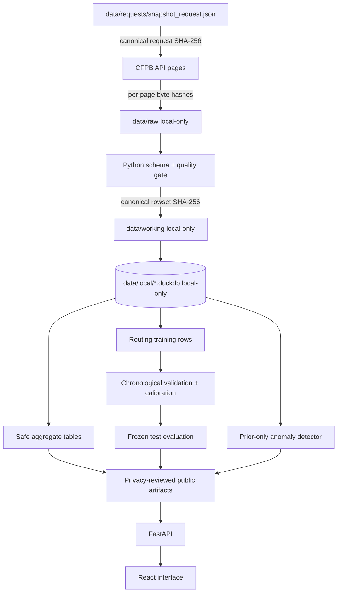

# Lineage and data card

## Dataset identity

**Source:** [CFPB Consumer Complaint Database](https://www.consumerfinance.gov/data-research/consumer-complaints/)

**Interface:** [CFPB complaint database API](https://cfpb.github.io/api/ccdb/)
and [field reference](https://cfpb.github.io/api/ccdb/fields.html)

**Snapshot policy:** an explicitly dated request for no more than 100,000
recent public complaint records. The request, extraction timestamp, pagination,
ordering, selected fields, QA result and hashes are retained in a sanitised
manifest. Raw row-level data are not distributed with this repository.

**Intended use:** a portfolio-scale complaints-operations and human-review
demonstration, plus frozen routing and monitoring evaluation.

**Not intended for:** consumer-population inference, company league tables,
automated complaint decisions, regulatory advice, eligibility/credit decisions
or contact with consumers.

## Source fields used

The pipeline minimises fields to those required for the decision and audit. The
manifest records the exact source names. Expected concepts include:

- complaint ID;
- date received and date sent to company;
- product, sub-product, issue and sub-issue;
- published consumer complaint narrative, when present;
- company and public response fields;
- company response to consumer and whether the response was timely; and
- submission channel and other explicitly approved operational dimensions.

The snapshot retains only the documented, normalised fields required for the
named operations decisions. It excludes ZIP code, the retired consumer-dispute
field, and unused tags. Missing values remain missing rather than being inferred
as negative outcomes.

## Population and known limitations

The database reflects complaints submitted to the CFPB and subsequently
published under the CFPB process. It is not a statistically representative
sample of consumers' experiences. Awareness, access, submission channels,
consumer choices, product usage, population and company size all influence
counts. Raw company complaint totals therefore cannot support comparative
performance claims without defensible exposure or market-share denominators.

Other important limitations are:

- The database generally updates daily, but an eligible complaint is published
  after a company response confirms a commercial relationship or after 15 days,
  whichever comes first. Recent dates can therefore be incomplete, and narrative
  processing can add further lag.
- Narratives are available only for a consented, processed subset, so a model
  trained on narrative-bearing records has an additional selection boundary.
- CFPB product and issue fields are operational labels. They can change over
  time and are supervised targets, not objective ground truth.
- Records can be corrected or removed after a snapshot. A live API replay may
  not reproduce historical bytes.
- Missingness and taxonomy coverage can vary by period, product and channel.
- A published narrative has undergone CFPB steps intended to remove personal
  information, but residual disclosure risk still warrants local-only handling.

Every analytical view carries the snapshot date and the applicable limitation.

## Consent and narrative handling

Published narratives are included only when the consumer consents and after
the CFPB takes steps to remove personal information. Consent may later be
withdrawn. The project therefore applies a stricter boundary than ordinary
public tabular data:

1. raw API responses containing narratives stay in `data/raw/` locally;
2. canonical row exports and any narrative-bearing DuckDB stay in ignored local
   directories;
3. logs never include narrative bodies, prompts or generated drafts by default;
4. manual factuality review files containing excerpts remain private;
5. public artifacts use aggregates and no complaint-level narrative text; and
6. a refresh compares narrative availability/withdrawals and triggers deletion
   plus rebuilding of affected local stores and derived text artifacts.

A withdrawal can make the original row bytes unavailable. The sanitised
manifest and hash may remain as processing evidence, but they are not a reason
to retain withdrawn narrative content.

## End-to-end lineage



### Lineage keys

- `snapshot_id`: stable identifier derived from the canonical request and
  extraction instance.
- `request_sha256`: SHA-256 of canonical UTF-8 request JSON.
- `page_response_hashes`: canonical-JSON SHA-256 for every total probe and
  downloaded page, in request order.
- `rowset_sha256`: hash of the deterministic canonical local row representation.
- `parent_sha256`: hash linking a derived artifact to its immediate input.
- `code_revision`: full Git commit SHA when available, with `dirty=true` if the
  working tree was not clean.
- `artifact_sha256`: hash of the promoted aggregate, model or evaluation file.

Canonicalisation rules and software versions are stored with the manifest;
`SHA-256` alone does not explain how rows were ordered or serialised.

## Quality gates

The QA report separates hard failures from warnings.

Hard failures include:

- record count outside `1..requested_max_records`;
- missing or duplicate canonical complaint IDs after the declared rule;
- unparseable required dates or records beyond the `as_of` boundary;
- missing required source columns/schema contract;
- request/page/row hash mismatch; and
- output artifacts that do not reference the current snapshot.

Warnings include measured optional-field missingness, unknown categorical
values retained as unknown, changes against a previous snapshot, low narrative
availability and publication-lag-sensitive coverage. Thresholds and observed
values are recorded, never replaced with a generic `passed` flag.

No model, evaluation or serving artifact is promoted after a hard failure.

## Reproducible snapshot procedure

Use the installed command and an explicit date:

```bash
cfpb-triage snapshot --as-of YYYY-MM-DD --max-records 100000
cfpb-triage qa PATH_RETURNED_BY_SNAPSHOT --as-of YYYY-MM-DD
```

For the complete local pipeline:

```bash
cfpb-triage build-all --as-of YYYY-MM-DD --max-records 100000
```

`build-all` must stop on failed QA. `cfpb-triage train` performs the frozen
chronological evaluation, while `cfpb-triage anomalies` builds trend evidence.
Use `--help` as the authoritative argument list for the installed revision.

The sanitised request and manifest may be committed after reviewing them for
paths, query values and narrative content. The raw files remain local.

## Git publication policy

Eligible after privacy review:

- extraction request JSON without credentials;
- sanitised manifest, QA counts and SHA-256 values;
- aggregate product/issue/time counts with adequate support;
- evaluation metrics, calibration bins and aggregate confusion tables;
- model configuration and, only after text-disclosure review, model binaries;
- schema definitions, tests and non-narrative demo fixtures.

Local-only:

- raw API pages and canonical row-level CSV/JSONL/Parquet;
- any DuckDB or database containing complaint rows or narratives;
- complaint-level predictions, prompts, completions and manual review sheets;
- request logs containing submitted narratives; and
- vocabulary/model artifacts that retain narrative fragments until a specific
  privacy review confirms they are safe to publish.

CI's path guard is a backstop, not a substitute for human review of a proposed
artifact.

## Refresh, retention and withdrawal

1. Freeze writes and record the current artifact hashes.
2. Pull a new explicit `as_of` snapshot and run QA.
3. Compare IDs, narrative availability, taxonomy and aggregate counts.
4. Purge locally retained narrative content that is no longer published; rebuild
   affected DuckDB, vectoriser/model and evaluation artifacts.
5. Train/score using the new immutable lineage chain; do not mutate old metric
   JSON in place.
6. Review privacy-safe diffs, then promote a new version.
7. Retain sanitised manifests according to the project policy; delete local raw
   narrative snapshots when no longer necessary.

## Data-card release checklist

- [ ] `as_of`, extraction timestamp and maximum count are explicit.
- [ ] Source URL, field list, ordering and pagination are recorded.
- [ ] All required QA observations and hashes pass.
- [ ] Record count/date range and narrative availability are documented.
- [ ] Publication-lag interval is labelled in derived views.
- [ ] Split boundaries and label mapping are frozen.
- [ ] No narrative-bearing or row-level data are tracked.
- [ ] Derived artifacts point to the correct parent/snapshot hash.
- [ ] CFPB representativeness and company-count limitations are visible.
- [ ] Withdrawal comparison and local deletion procedure have been run.

